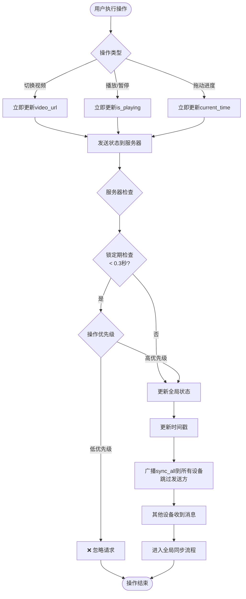
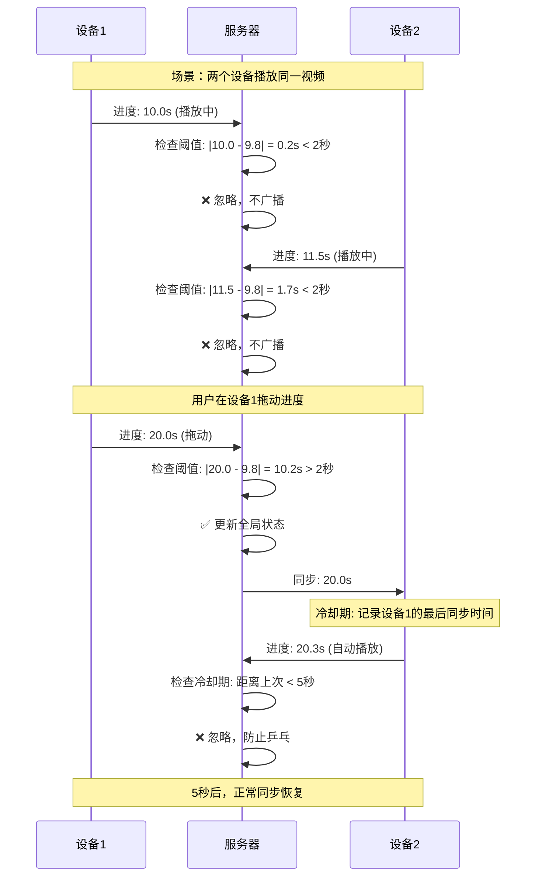
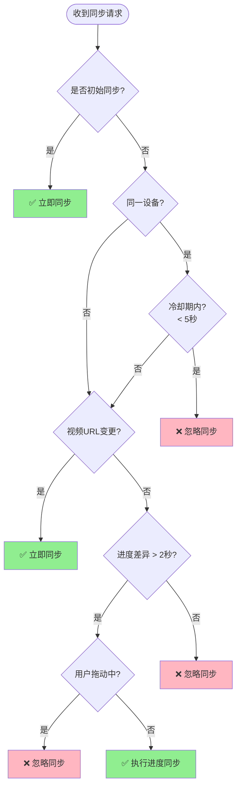

# 视频同步系统 - 同步逻辑流程图

## 完整同步流程

```mermaid
flowchart TD
    Start([设备收到同步消息]) --> CheckInit{是否初始同步?}

    CheckInit -->|是| InitSync[初始同步：直接应用全局状态]
    CheckInit -->|否| CheckCooldown{冷却期检查}

    CheckCooldown --> CheckSameDevice{同一设备?}
    CheckSameDevice -->|是| CheckTimePassed{距离上次同步<br/>> 5秒?}
    CheckSameDevice -->|否| ProceedSync

    CheckTimePassed -->|否| IgnoreSync[❌ 忽略同步<br/>原因: 冷却期内]
    CheckTimePassed -->|是| ProceedSync

    ProceedSync[更新最后同步记录] --> CheckVideoChange{视频URL变更?}

    CheckVideoChange -->|是| LoadVideo[加载新视频]
    CheckVideoChange -->|否| CheckTimeDiff{时间差异检查}

    LoadVideo --> CheckPlaying{需要播放?}
    CheckPlaying -->|是| PlayVideo[播放视频]
    CheckPlaying -->|否| PauseVideo[暂停视频]
    PlayVideo --> End([同步完成])
    PauseVideo --> End

    CheckTimeDiff --> CalculateDiff[计算差异: |local - remote|]
    CalculateDiff --> CheckThreshold{差异 > 2秒?}

    CheckThreshold -->|否| LogIgnore[📝 记录日志: 差异在阈值内]
    CheckThreshold -->|是| CheckDragging{用户正在拖动?}

    CheckDragging -->|是| LogDragging[📝 记录日志: 正在拖动，忽略]
    CheckDragging -->|否| SyncProgress[⏱️ 调整进度到目标时间]

    LogIgnore --> End
    LogDragging --> End
    SyncProgress --> End
    IgnoreSync --> End
```

## 用户主动操作流程



## 防乒乓同步机制



## 决策树：是否触发同步？



## 配置参数说明

| 参数 | 值 | 说明 |
|------|-----|------|
| **SYNC_THRESHOLD** | 2.0秒 | 同步阈值：只有差异超过2秒才触发同步 |
| **SYNC_INTERVAL** | 3000ms | 进度上报间隔：每3秒上报一次 |
| **SYNC_COOLDOWN** | 5.0秒 | 冷却期：同一设备5秒内不重复同步 |
| **STATE_LOCK** | 0.3秒 | 锁定期：0.3秒内只处理高优先级操作 |

## 同步场景示例

### 场景1：正常播放（无同步）
```
设备1: 10.0s -> 10.3s -> 10.6s -> 10.9s (每秒上报)
设备2: 10.1s -> 10.4s -> 10.7s -> 11.0s
差异:  0.1s -> 0.1s -> 0.1s -> 0.1s
操作:   忽略 -> 忽略 -> 忽略 -> 忽略
```

### 场景2：大差异同步
```
设备1: 用户拖动到 30.0s
服务器: 检测差异 |30.0 - 15.0| = 15.0s > 2秒 ✅
服务器: 广播同步消息
设备2: 收到同步，调整到 30.0s
```

### 场景3：防止乒乓
```
T=0s:  设备1拖动到 30.0s，服务器广播
T=2s:  设备2自动播放到 30.5s，上报
       服务器: 冷却期内（< 5秒），忽略 ❌
T=3s:  设备2自动播放到 31.0s，上报
       服务器: 冷却期内（< 5秒），忽略 ❌
T=6s:  设备2自动播放到 32.5s，上报
       服务器: 冷却期已过，检查差异 32.5-30.0=2.5s > 2秒 ✅
       服务器: 广播同步消息
```

## 关键优化点

1. **阈值优化** (2秒)
   - 避免微小网络延迟导致的频繁同步
   - 人耳无感的差异不需要同步

2. **冷却期机制** (5秒)
   - 防止同一设备反复触发同步
   - 给自动播放留出稳定时间

3. **操作优先级**
   - 用户主动操作（拖动、点击）优先级最高
   - 被动上报（timeupdate）优先级最低

4. **全局暂停保护**
   - 暂停状态下忽略进度上报
   - 只处理播放/暂停切换操作
